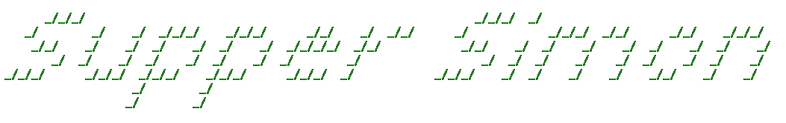

  

  <h2>Squirrel-Core</h2>
  

    <strong>SquirrelCore</strong> is an open-source PCB built around the <strong>ESP32-S3</strong> and <strong>SX1262</strong>.
    It is designed for long-range mesh networking using the open-source 
    <a href="https://meshtastic.org" target="_blank" rel="noopener noreferrer">Meshtastic</a> firmware.
    It can function as a client, node, or repeater in a distributed network.
  

  

    I wanted to design this as a challenge and a learning expirence on radio circuity for some time now, but without the funding (I'm kinda broke rn) this idea of mine wouldn't come to reality.
  

  <h3>Continuing the development process</h3>
  

    My plans are to not just stop on the PCB design but to also design a case around it, I have some basic blender skills to work with however it will still be a very diffrent work flow to what I've done before.
  

  

    I also need to update and test the firmware.
  

  <h3>Features</h3>
  <ul>
    <li>ESP32-S3 microcontroller</li>
    <li>8MB Flash memory</li>
    <li>LoRaWAN, Wi-Fi, Bluetooth, and USB-C serial connectivity</li>
    <li>Adjustable battery charging: 400 mA or 1 A</li>
    <li>OLED display</li>
    <li>BME280 sensor (temperature, humidity, pressure)</li>
    <li>GPS module</li>
  </ul>

  <h3>Meshtastic Links</h3>
  

    <a href="https://meshtastic.org" style="text-decoration:none; font-weight:bold;">Get Started</a> 
    - <a href="https://meshtastic.org/docs/development/firmware/build">Building Instructions</a> – Learn how to compile the firmware from source. 
    - <a href="https://meshtastic.org/docs/getting-started/flashing-firmware/esp32/">Flashing Instructions</a> – Install or update the firmware on your device.
  

  <h3>Licensing</h3>

  <ul>
    <li>The core Meshtastic firmware in <code>/firmware/meshtastic</code> remains under its original license (as provided by the Meshtastic project).</li>
    <li>The SquirrelCore variant files in <code>/firmware/meshtastic/variants</code> are MIT-licensed (Copyright 2025 Supper Simon).</li>
    <li>When updating the repository, the variant is copied into Meshtastic, but the original Meshtastic license still applies to its code.</li>
  </ul>

